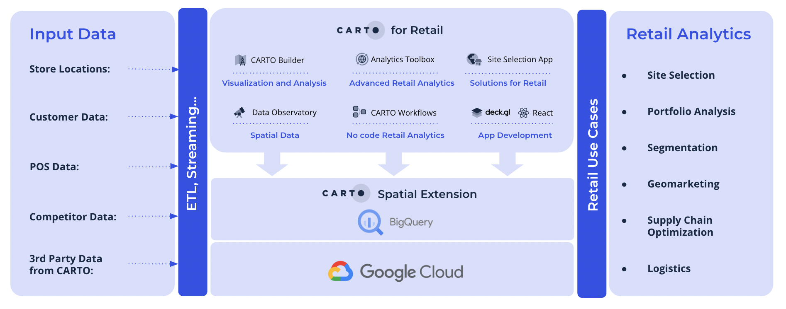
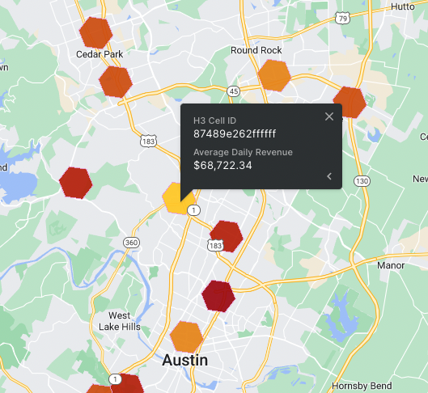
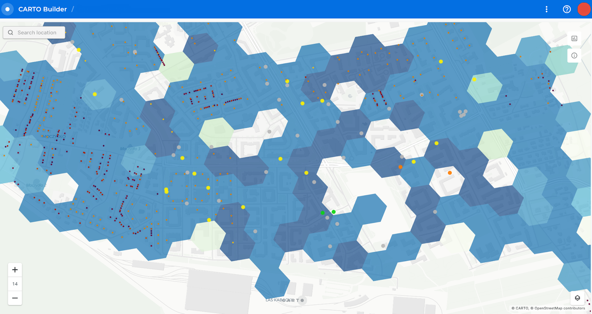
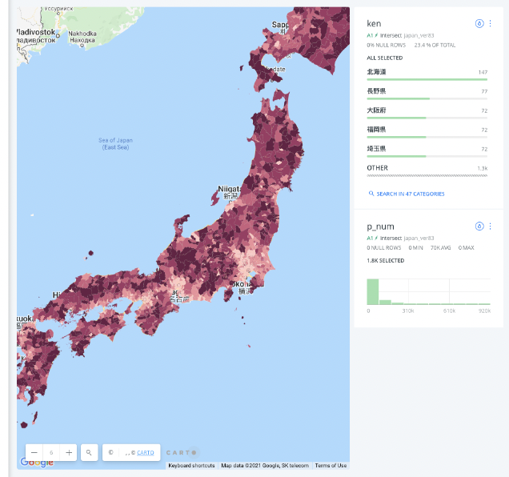

# Reference Guide: Geospatial Analytics for Retail with CARTO

Authors: 

Matt Forrest, CARTO, VP of Solutions Engineering

Remy Welch, Google, Cloud Engineer

Special Acknowledgments: The authors would like to thank Daria Kolarczyk, Jamie Woolley, Helen McKenzie and Travis Webb for their contributions to this guide.


# Table of Contents


* Introduction
* Components
* Implementation
* Example and Demonstration
* Use Cases


## Introduction

Retail companies are increasingly using geospatial data to understand their customers and solve important business problems. For example, the surrounding demographic make-up and local foot traffic patterns are important to take into consideration when choosing a new store location.

[CARTO](https://carto.com/), a Google Cloud Partner, is a leading cloud-native Location Intelligence platform that enables organizations to use spatial data and analytics for more efficient delivery routes, better behavioral marketing, strategic store placements, and much more. The CARTO Platform offers 3rd party data enrichment, advanced map visualization, spatial analysis functions and app development resources for key retail use cases natively through Google Cloud’s BigQuery data warehouse. 

This solution guide will discuss [CARTO for Retail](https://carto.com/solutions/carto-for-retail/), which is a set of platform components and analytical functions developed specifically to address the most important business decisions in retail. The CARTO for Retail functions are deployed directly in BigQuery, and leverage models that combine spatial analytics with BigQuery Machine Learning tools to run predictions and analysis in the same location as your data. The CARTO platform uses intuitive point-and-click spatial SQL analysis and is fully integrated with Google Maps.


## Components


### CARTO for Retail Platform Overview

CARTO for Retail connects natively with BigQuery hosted location data, removing the need to move data in and out of various data warehouses to do spatial analysis. Users can search, visualize and subscribe to more than 12,000 relevant locations datasets through the [CARTO Data Observatory](https://carto.com/data-observatory/), then enrich their own data with these datasets in BigQuery. Users also have the ability to perform point-and-click analysis on their data with the CARTO Builder, a user interface for spatial analysis. Advanced analytical functions are automatically pushed to BigQuery for processing, which simplifies workflows and eliminates any limits on scalability. 

The CARTO platform contains the following components to address the most common retail analytics use cases. 





_CARTO for Retail Components Diagram_


### CARTO Builder

Builder is a web-based drag and drop analysis tool for both technical and non-technical users to discover and analyze location data. It offers advanced, point-and-click location analyses and by connecting to BigQuery, allows for real-time visualization and spatial analytics at scale, regardless of data source, file size, format, or model. Analysis results from the CARTO for Retail functions can be visualized in CARTO Builder.


### Data Observatory

The [CARTO Data Observatory](https://carto.com/data-observatory/) enables the evaluation and curation of 3rd party location datasets to understand and predict store performance. The data catalog features a wide range of datasets for any geography, along with standardized spatial aggregations. Relevant datasets for retail include consumer socio-demographics, Points of Interest, foot & road traffic, behavioral data or credit card transactions. Enrichment with these datasets takes place in the CARTO Analytics Toolbox.

To learn more about the available datasets in the Data Observatory, check out: [https://carto.com/spatial-data-catalog/](https://carto.com/spatial-data-catalog/) 


### CARTO Analytics Toolbox 

CARTO has developed a series of retail-specific User Defined Functions and stored procedures within the CARTO Analytics Toolbox that can be natively implemented in BigQuery for advanced spatial analytics relevant for retail. These functions enable Data Scientists and Analysts to work on retail network planning use cases such as identifying the optimal locations for estate expansion or consolidation. [CARTO’s Analytics Toolbox for BigQuery](https://docs.carto.com/analytics-toolbox-bigquery/overview/getting-started/) can be accessed directly through the CARTO platform, or via the BigQuery console. 

The following analyses can be found in the Analytics Toolbox. More information on the specific procedures can be found in the Architecture section of this guide.


* [Enrichment](https://docs.carto.com/analytics-toolbox-bigquery/sql-reference/data/) \
Enrich your data with spatial data that you own or with public and premium data from the CARTO Data Observatory
* [Clustering](https://docs.carto.com/analytics-toolbox-bigquery/sql-reference/clustering/)

    Analysis to Identify the optimal store locations by geographically clustering customers, competitors and existing stores. 

* [Commercial Hotspots](https://docs.carto.com/analytics-toolbox-bigquery/sql-reference/retail/#commercial_hotspots)

    Models to focus on the most effective areas for expansion, based on the surrounding retail fabric.

* [Whitespace Analysis](https://docs.carto.com/analytics-toolbox-bigquery/sql-reference/retail/#find_whitespace_areas)

    Routines to identify the best potential locations, where expected revenue is higher than  top performing stores, and where key business criteria are met. 

* [Twin Areas Analysis](https://docs.carto.com/analytics-toolbox-bigquery/sql-reference/retail/#find_twin_areas)

    ML-driven analytics to focus network expansion strategies on the most similar locations to the best performing stores.

* [Store Revenue Prediction](https://docs.carto.com/analytics-toolbox-bigquery/sql-reference/retail/#predict_revenue_average)

    A trained Machine Learning model to predict the annual revenue of a planned store location.

* [Store Cannibalization](https://docs.carto.com/analytics-toolbox-bigquery/sql-reference/retail/#build_cannibalization_data)

    A model to estimate the overlap of areas and spatial features that a new store would have with the existing store network.


### Out-of-the-box applications for Retailers

Accessed through a unified solution, the [CARTO for Site Selection](https://carto.com/solutions/site-selection/) application includes relevant 3rd party data, advanced map visualization and embedded models to pinpoint the best locations for network expansion.

CARTO for Retail webinar:

[https://go.carto.com/webinars/carto-for-retail](https://go.carto.com/webinars/carto-for-retail) 


## Implementation

This section will provide technical details about the CARTO for Retail functions and their connection with BigQuery. To illustrate how the CARTO for Retail components can be used, a code example and a video demonstration are provided.


### Connection to BigQuery

Detailed instructions on how to connect to BigQuery [can be found here](https://docs.carto.com/carto-user-manual/connections/creating-a-connection#connection-to-bigquery). CARTO can connect to Google BigQuery in two ways:


* **Service Account:** these are JSON credentials generated in Google Cloud Console, and are usually granted specific permissions to certain projects or datasets.
* **Sign in with Google:** connect your own Google account and use the Google BigQuery projects that you already have access to.

The out-of-the-box Site Selection application communicates with the rest of the CARTO platform, and by extension with BigQuery, through the [CARTO API](https://api-docs.carto.com/).


### BigQuery´s role in CARTO for Retail

BigQuery provides both data storage, the building blocks for several Analytics Toolbox methods, and the compute capacity to run these analytics methods. By using BigQuery’s scalable processing power, there is no need to move data around to perform analytical functions, saving time and money.

CARTO has created a number of retail-specific analytical models using BigQuery Machine Learning, which are outlined in the following section. Each model can be based on a flexible trade area configuration. Model parameters can be adjusted by the user as needed, and depend on the available source data. 

For each analysis, CARTO uses a different regression model provided by BigQuery ML. The standard model CARTO uses is the XGBoost boosted tree model. CARTO’s Data Science team have developed these models to eliminate any issues with overfitting and dimensionality, and to ensure correct feature selection.


### CARTO Analytics Toolbox Retail Analysis

The [retail analysis](https://docs.carto.com/analytics-toolbox-bigquery/sql-reference/retail/) module of the CARTO platform contains procedures to perform analysis natively in BigQuery to solve specific retail use cases, such as revenue prediction. These procedures can be used in the CARTO platform (for example, in the CARTO Builder), or they can be used directly in the BigQuery Console. These procedures are described below:


#### Revenue prediction


* [BUILD_REVENUE_MODEL_DATA](https://docs.carto.com/analytics-toolbox-bigquery/sql-reference/retail/#build_revenue_model_data) – Prepares the model data to be used in the training and prediction phases.
* [BUILD_REVENUE_MODEL](https://docs.carto.com/analytics-toolbox-bigquery/sql-reference/retail/#build_revenue_model) – Creates the model and its description tables from the input model data.
* [PREDICT_REVENUE_AVERAGE](https://docs.carto.com/analytics-toolbox-bigquery/sql-reference/retail/#predict_revenue_average) – Predicts the average revenue of an additional store located in the specified grid cell.


#### Site Selection analysis


* [FIND_TWIN_AREAS](https://docs.carto.com/analytics-toolbox-bigquery/sql-reference/retail/#find_twin_areas) – Procedure to obtain the twin areas for a given origin location in a target area, based on the values for a set of variables.
* [FIND_WHITESPACE_AREAS](https://docs.carto.com/analytics-toolbox-bigquery/sql-reference/retail/#find_whitespace_areas) – Identifies cells with the highest potential revenue (_whitespaces_), while satisfying a series of criteria (e.g. presence of competitors).
* [COMMERCIAL_HOTSPOTS](https://docs.carto.com/analytics-toolbox-bigquery/sql-reference/retail/#commercial_hotspots) – Locates hotspot areas by calculating a combined Getis-Ord Gi* statistic using a uniform kernel over several variables.


#### Cannibalization analysis


* [BUILD_CANNIBALIZATION_DATA](https://docs.carto.com/analytics-toolbox-bigquery/sql-reference/retail/#build_cannibalization_data): Builds the dataset for the existing locations to be used to estimate the overlap with potential new locations.
* [CANNIBALIZATION_OVERLAP](https://docs.carto.com/analytics-toolbox-bigquery/sql-reference/retail/#cannibalization_overlap): Estimates the overlap of areas and spatial features that the new store would have with the existing stores.


#### BigQuery Tiler

By transforming your retail location data into tiles, you can greatly improve the performance of your spatial visualizations. Vector tiles are data that has been aggregated in a way that makes them optimal for visualization. A tileset is a collection of tiles, which would cover a specific area on a map. You can create vector tiles directly in BigQuery SQL using CARTO’s [BigQuery Tiler ](https://carto.com/bigquery-tiler/). 

	With the [tiler function](https://docs.carto.com/analytics-toolbox-bigquery/sql-reference/tiler/), which is part of the CARTO Analytics Toolbox, you can define your tiles’ parameters (e.g, spatial index and zoom level) and the output is saved in BigQuery. The data is partitioned and optimized so that even billions of rows can then be rendered in a CARTO visualization with low latency.


### Video Demonstration

To better understand the functions of the CARTO for Retail platform, please the watch this demonstration, which walks through the following steps: 


* Connection to BigQuery hosted data
* Running a native data enrichment process
* Executing a Analytics Toolbox Retail function
* Generate output on a map visualization

CARTO for Retail Demo Video:

[https://drive.google.com/file/d/1MQ1nPbsU6G8E5_cbY82qk_t2kZABaviP/view?usp=sharing](https://drive.google.com/file/d/1MQ1nPbsU6G8E5_cbY82qk_t2kZABaviP/view?usp=sharing) 


### Code Example

To showcase what can be accomplished with BigQuery and the CARTO Analytics Toolbox for Retail, let’s walk through the steps to identify twin areas in Texas to match to a high performing store in Austin, TX.

First, we need to create our data model using the [carto.BUILD_REVENUE_MODEL_DATA ](https://docs.carto.com/analytics-toolbox-bigquery/sql-reference/retail/#build_revenue_model_data)function. This function takes in stores, revenue data, and competitors, then creates an evaluation grid to find twin areas, trade areas (which can be any polygon such as a radius, drive time, or custom created polygon), and desired enrichment variables. Below is an example of this function:


```
CALL `carto-un`.carto.BUILD_REVENUE_MODEL_DATA(
  -- Stores: revenue, store, geom
  '''
  SELECT id as store, revenue, geom FROM project.dataset.stores_table
  ''',
  -- Stores information variables - optional
  NULL,
  -- Competitors: competitor, geom
  '''
  SELECT id as competitor, geom FROM project.dataset.competitors_table
  ''',
  -- Area of interest: geom
  '''
  SELECT state_geom as geom FROM `bigquery-public-data.geo_us_boundaries.states` WHERE state_name IN ('Texas', 'Arizona')
  ''',
  -- Grid params: grid type and level
  'h3', 7,
  -- Decay params: kring size and decay function
  1, '',
  -- Data Observatory enrichment
  [('total_pop_3200daaa', 'sum'), ('households_3cda72a3', 'sum'), ('median_age_fb9fb9a', 'sum'), ('pop_25_years_ov_3eb5c867', 'sum'), ('median_income_20186485', 'avg'), ('income_200000_o_6cda1f8a', 'sum'), ('median_rent_37636cdd', 'sum'), ('families_with_y_228e5b1c', 'sum'), ('employed_pop_7fe50b6c', 'sum')],
  'carto-data.CARTO_DO_USER_ID',
  -- Custom data enrichment
  NULL, NULL,
  -- Output destination prefix
  'project.dataset.retail_model_texas'
);
```


Next, we need to build out the revenue model using [carto.BUILD_REVENUE_MODEL](https://docs.carto.com/analytics-toolbox-bigquery/sql-reference/retail/#build_revenue_model). This uses BigQuery ML to perform the model predictions and supports [LINEAR_REG](https://cloud.google.com/bigquery-ml/docs/reference/standard-sql/bigqueryml-syntax-create-glm) and [BOOSTED_TREE_REGRESSOR](https://cloud.google.com/bigquery-ml/docs/reference/standard-sql/bigqueryml-syntax-create-boosted-tree). Check the [model documentation](https://cloud.google.com/bigquery-ml/docs/reference/standard-sql/bigqueryml-syntax-create#model_option_list) for more information.

This will output the model, SHAP values, and model statistics to understand the model performance. Below is an example query to run this:


```
CALL `carto-un`.carto.BUILD_REVENUE_MODEL(
   -- Model data
  'cartodb-gcp-solutions-eng-team.forrest.retail_model_texas',
   -- Options
   '{"MAX_ITERATIONS": 20}',
   -- Output destination prefix
   'cartodb-gcp-solutions-eng-team.forrest.retail_model_texas_model'
);
```


Finally, we can now predict our twin areas. In this function we pick a target index which we can identify from our map. As we can see here, this cell is the top performing store we want to find similar areas to.





From here we can run our [Twin Areas model](https://docs.carto.com/analytics-toolbox-bigquery/sql-reference/retail/#find_twin_areas). The model is based on Principal Component Analysis (PCA) and the full description [can be found here](https://carto.com/blog/spatial-data-science-site-planning/). We provide a query containing our target H3 cell, a second query of the cells we want to target to study (any cell without a store in Texas), and several other arguments to fine tune our results:


```
CALL `carto-un`.carto.FIND_TWIN_AREAS(
   -- Input queries
   '''SELECT * FROM `project.dataset.retail_model_texas` WHERE index = '87489e262ffffff' ''',
   '''SELECT * FROM `project.dataset.forrest.retail_model_texas` WHERE revenue_avg = 0''',
   -- Twin areas model inputs
   'index',
   0.75,
   NULL,
   'project.dataset.twin_area_texas'
);
```


The result is [this interactive map](https://clausa.app.carto.com/map/0b8fe0fe-f191-4545-a37d-b0f06e0c2b9d) which shows us the top areas that will likely perform the most similar to our target store based on our geospatial factors. We can also include other store factors in our first step to add site specific details like square footage or year built.


## Use Cases


### Retail Site Selection

Whether it’s expansion, consolidation or performance monitoring - location data is critical to avoid million-dollar mistakes in retail brick & mortar site selection.

Traditional BI tools may simply show you where your store locations are and offer basic insights. Google BigQuery ML and CARTO for Retail provide sophisticated and transparent analytical models to predict where the next opportunity is for brick & mortar operations, considering relevant consumer behavior. By bringing together existing internal data with external data streams such as foot traffic, demographics, points of interest, credit card transactions & consumer behavior, users can predict revenues at new or existing sites. Insights on predicted store performance for target sites can be shared easily through an intuitive tool for non-technical users, whether it’s Real Estate, Operations, Strategy or Marketing.





Allegro is the most popular shopping platform in Poland and the largest e-commerce platform of European origin. The company decided to invest in its own logistics and delivery services. Using its own fulfillment infrastructure, network of parcel lockers, and last-mile delivery services, Allegro aimed to improve consumer convenience and speed up deliveries. 

The challenge in Allegro’s case was having the right analytics platform and tools in place to support their network expansion in 3 key areas: strategy, execution, and performance measurement. Allegro needed to obtain a visual representation of all analyzed data, readily available in the form of interactive, user-friendly dashboards. CARTO’s Location Intelligence platform provided the out-of-the-box capabilities the Allegro team was looking for, with seamless cloud integration and data processing, fully customizable map visualizations, and advanced spatial analytics.

By using Google’s BigQuery data warehouse, internal and external datasets, integrations, and CARTO, Allegro built an easy to use site selection application. The tool is used by the Field Expansion team to discover and assess the profitability of a given location. Choosing CARTO’s leading Location Intelligence platform perfectly complemented Allegro’s already existing cloud-native approach. As Allegro utilizes a rich technology stack, being able to provide seamless integration with existing tools, such as the Google Cloud Platform and BigQuery data warehouse, were important factors in the decision-making process.

Learn more at: [https://carto.com/customer-stories/allegro_omnichannel-ecommerce/](https://carto.com/customer-stories/allegro_omnichannel-ecommerce/)


### Geomarketing

For outdoor marketing campaigns, digital advertising or evolving merchandising decisions around the store network, understanding where existing & potential new customers are is becoming the key differentiator for today’s modern retail marketer. 

Data streams such as demographics, credit card insights or human mobility allow for hyper targeted campaigns maximizing marketing campaign ROI.


### Logistics and Supply Chain Optimization 

Given the rise in e-commerce & the growing trend for on-demand delivery services - consumer expectations have evolved drastically. Retailers now have to use advanced analytics to optimize how their stores, distribution centers, & logistics partners work together to meet the demands of today’s unrelenting consumer. 

Thanks to data from the CARTO and the Analytics Toolbox, retailers can do this by defining efficient territories & optimizing routings, bringing added value to existing operations. Whether it’s optimizing operations for vending machines or deciding on distribution center locations for a large grocery store chain, CARTO combined with BigQuery offers the tools and insight needed to deliver real business impact.  





Coca-Cola Bottlers Japan Inc. (CCBJI) produces and supplies approximately 90% of the Coca-Cola system’s products in Japan. With a network of over 700,000 vending machines across Japan, CCBJI collects and hosts a huge amount of data in BigQuery regarding not only the overall sales performance of each machine, but also how individual products perform per machine and location. Historically CCBJI had to extract the data necessary for analysis from the core system, build their own mechanism to create a data warehouse using ETL tools, and perform various analyzes.

CCBJI joined foot traffic, Points of Interest and sociodemographic data along with their vending machine location data in BigQuery. This data amounted to over 2 billion rows, so to help analyze it they implemented a geohash spatial index using the CARTO Analytics Toolbox. To visualize the data in CARTO, they processed it into tiles using the [BigQuery Tiler.](https://carto.com/bigquery-tiler/) They then added sales data and built a model in Google’s Vertex AI that predicted the potential sales of vending machines in new locations. They output the model’s predictions to BigQuery, and built a visualization in CARTO that showed the color-coded potential sales in each location. With this information, CCBJI was able to predict how much restocking supplies they would need, as well as where new vending machines should be placed.

See the visualization and learn more at: [https://carto.com/customer-stories/cocacola-site-selection/](https://carto.com/customer-stories/cocacola-site-selection/)


## Additional Resources

Links:

[CARTO Spatial Extension for BigQuery](http://carto.com/bigquery/spatial-extension)

[CARTO Documentation Analytics Toolbox](https://docs.carto.com/analytics-toolbox-bigquery/overview/getting-started/)

Possible CTAs

[CARTO 14-day Free Trial](http://carto.com/signup)

[Request a Personalised Demo](https://carto.com/request-live-demo/)
