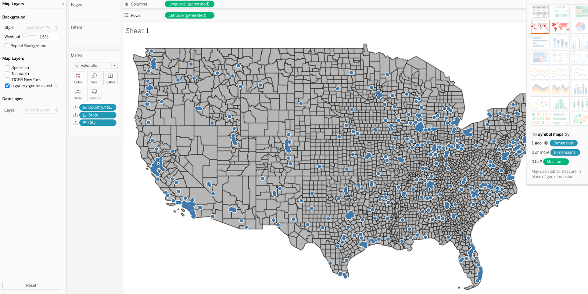

# Using BigQuery Spatial Data in Tableau through WMS server


## 1. Introduction

Web Map Service (WMS) is an open standard defined by the Open Geospatial Consortium (OGC) for serving georeferenced map images over the internet. Tableau is a visual analytics platform to explore and manage data. WMS with Tableau is a powerful pairing that can add geospatial data to your visualizations.

In this document, you'll learn what WMS is, how to configure it for use with Tableau, how to connect to WMS servers, how to use WMS layers in Tableau, and how to customize WMS layers to suit their needs.


## 2. GeoServer Web Map Services (WMS)  

WMS is a standard protocol for serving georeferenced map images over the internet. It is a widely used standard for accessing and sharing maps and related geographic data over the web. WMS provides a way to access and display geographic data in a variety of client applications, including web browsers, desktop GIS software, and mobile devices.

In a WMS service, map images are generated on the fly by the server in response to user requests. The client application sends a request to the WMS server for a specific map image, specifying the area of interest, the desired size and format of the image, and any other options such as the desired layers or styling. The server responds with the requested image in the specified format, which can be displayed in the client application.

For more information about WMS server operation and management, see the [WMS Server documentation](https://mapserver.org/ogc/wms_server.html). 


## 3. Use WMS server in Tableau


### 3.1 Connect to a WMS server 


1. In Tableau Desktop, select Map > Background Maps >WMS Servers.

    


2. In the Add WMS Servers dialog box, type the URL for the server you want to connect to in Tableau, and then click OK.


Select "Use tiled maps" option, Tableau will request tiles from the server in the appropriate format, rather than downloading and rendering the entire map image at once. This can improve the speed and efficiency of the map visualization in Tableau.


```
Not checking this option could dramatically slow the client side map tile rendering. 
```

Add WMS server URL.

You can add as many map servers as you want to a workbook. Each WMS server you add appears as a background map in the Background Maps menu.


### 3.2 Use a WMS background map

After you connect to a WMS server, you can create a map view using the WMS background map that Tableau creates.


1. In Tableau Desktop, select Map > Background Maps, and then select a WMS background map to use in the view. \


2. Add a datasource. In this example, we use the builtin sample data of sample-superstores. 


3. Add geographic fields to the view by dragging the city field to the marks. 


4. Select Map > Map Layers, and then select the map layers you want to show in the view. \


5. Map layer shown. You can enable the map controls to zoom in and out, pan maps etc. 



```
Please note that Tableau Desktop maps use the EPSG 3857 (Web Mercator) projection while WMS servers use the EPSG 4326 or EPSG 4269 projections. The EPSG 4326 projections may look distorted, particularly at northern latitudes.
```

### 3.3 Settings in Tableau for Maps


##### Map Layer Background Washout

Map Layer Background Washout reduces the opacity or saturation of the background of a map layer to allow the underlying data to stand out more prominently. It can be particularly useful when working with map data that has a lot of detail or complexity, and you want to highlight specific data points or patterns.

To apply a Map Layer Background Washout in Tableau, Select ‘Map’ menu, then ‘Map Layers’


You can then adjust the Washout percentage setting, with 100% being completely transparent. 


The following images are Washout at 0% and 50%.


<table>
  <tr>
   <td>


   </td>
   <td>


   </td>
  </tr>
</table>


##### Map Options

You can set some map controls tools visibility including show map scale using the Map Options Menu. Available options shown in the following image. 


### 3.4 Common error messages


1. Error message: The map cannot be drawn because there was an error retrieving map tiles. 

    Solution: Select “Map” then “Map Layers”, check the right map layer. 

2. Error message: One or more of the map images from the server were blank. 

    Solution: Data from the WMS server does not match the data within the view. Make sure the data in the view corresponds to the map data, usually by pan/zoom to an area that matches with the WMS server map data. 


### 3.5 Save a WMS server as a Tableau map source

After you add a WMS server to your workbook, it is saved with the workbook and available to anyone you share the workbook with. You can also save a WMS server as a Tableau Map Source (.tms) file, which you can share with others so they can quickly connect to it and use it in their own workbooks.


1. Select Map > Background Maps > Map Services. This opens the Map Services dialog.
2. Select the map you want to save as a Tableau map source, and click Export. This opens the Export Connection dialog.
3. Type a file name, choose a location, and click Save.


### 3.6 Common problems with WMS 

Some common problems when using WMS include:


* Slow loading times. The content, speed, and performance of a WMS server depends on the network and WMS provider. For example, Handling large amounts of data or high numbers of simultaneous requests can strain WMS servers and impact performance. Optimizing server configurations and caching strategies can mitigate these challenges. 
* Limited data availability. WMS relies on the availability and quality of underlying data sources. If the data is outdated, incomplete, or of low quality, it can affect the accuracy and usefulness of the rendered maps.
* Difficulty in customizing the maps to fit specific needs. For example, Applying custom styles and symbols to WMS layers may require advanced knowledge of the server's styling capabilities, such as using Styled Layer Descriptor (SLD) or vendor-specific styling options. Achieving the desired visual representation can sometimes be challenging.
* Maps cannot be  accessed offline. 


## 4. Serving BigQuery Spatial Data with GeoServer

GeoServer is a widely-used open-source web map service known for its performance, scalability, and ability to handle large amounts of data and high traffic loads. It supports various spatial data formats and protocols such as WMS, WFS, and WCS. However, serving BigQuery Spatial Data with GeoServer was not straightforward until the release of the BigQuery driver like [Bigquery-geotools](https://github.com/GoogleCloudPlatform/bigquery-geotools) which enables users to connect and serve BigQuery spatial data, including polygons and polylines, as a layer in GeoServer. 

Geoserver can run in a tomcat servlet container on [Cloud Run](https://cloud.google.com/run), using [Filestore](https://cloud.google.com/filestore) as a shared configuration directory and shared geowebcache blob store location. Please see the [readme for](https://github.com/GoogleCloudPlatform/solutions-geospatial-analytics/blob/main/geoserver-run/README.md) detailed instructions. 


### 4.1 GeoServer Settings for Performance

Once a GeoServer instance is set up, the following GeoServer settings can impact tile serving performance and improve overall performance:


* GeoWebCache Caching Setting: Enable caching to reduce server requests and improve response times for frequently-requested data. GeoServer uses GeoWebCache for integrated tile caching, increasing server responsiveness and reliability. Configure disk quotas for caching settings to monitor disk usage.
* Use image formats with lower file sizes: Choose image formats like PNG8 or JPEG for raster data to decrease file size and reduce the time it takes to transmit the data over the network.
* Optimize database performance: If your GeoServer is connected to a database, ensure that the database is correctly optimized, with appropriate indexes and spatial indexes in place for efficient querying.
* Adjust JVM settings: Tune the Java Virtual Machine (JVM) settings, such as heap size and garbage collection options, to improve the performance of the GeoServer instance.
* Use hardware acceleration: When possible, enable hardware acceleration to allow the built-in Graphics Processing Unit (GPU) and/or specialized graphics cards to offload operations from the CPU and complete rendering faster..
* Configure connection pooling: Optimize the number of concurrent connections to the data source by configuring connection pooling settings in the data store configuration.
* Enable HTTP compression: Enable HTTP compression (e.g., gzip) to reduce the amount of data transferred over the network, which can improve response times for clients with slower connections.
* Use multi-threading and parallel processing: Configure GeoServer to take advantage of multi-core processors and parallel processing to improve map rendering and data processing performance.

By optimizing these GeoServer settings, you can achieve better tile serving performance and overall server efficiency. Keep in mind that balancing cache performance and resource usage is essential for optimizing your GeoServer's performance.

The [Tableau BigQuery connection](https://help.tableau.com/current/pro/desktop/en-us/examples_googlebigquery.htm) doesn’t not support displaying BigQuery geometry type like Polygon. However, with WMS as a background map, we can use a GeoServer to pass through WMS requests that serve Polygon data for Tableau. 


## See Also
- [Deploy Geoserver on Compute Engine VM](https://github.com/GoogleCloudPlatform/solutions-geospatial-analytics/tree/main/geoserver-run)
- [Deploy Geoserver on Cloud Run](https://github.com/GoogleCloudPlatform/solutions-geospatial-analytics/tree/main/geoserver-run)
